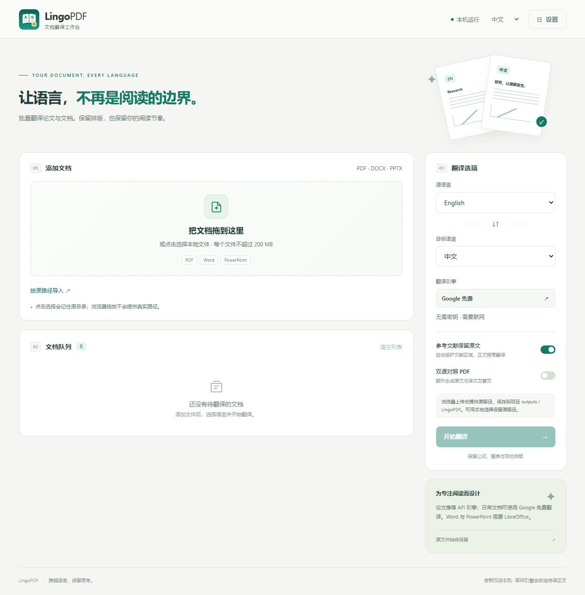
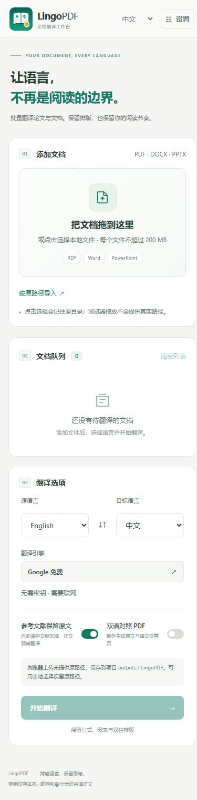

# 🌐 LingoPDF

**批量 PDF 翻译 · 保留原排版 · 免费开源**

将英文论文、报告、文档批量翻译成中文（也支持日/韩/法/德/俄/西等语言），翻译后的 PDF 保留原始排版——公式、图表、双栏结构原样不动。

[中文](#中文) | [English](#english)

---

# 中文

## 📖 这是什么

LingoPDF 是一个 **批量 PDF 翻译工具**。你可以把多个 PDF 文件拖进去，一键翻译成你需要的语言，翻译后的 PDF 保留原始排版——标题、段落、公式、图表、双栏布局都不会乱。

**适合谁用：**
- 🎓 读英文论文的科研人员——批量翻译成中文，排版不乱，阅读体验好
- 💼 需要翻译外文报告的上班族——拖进去就走，不用一个个复制粘贴到翻译软件
- 🌍 任何需要把 PDF 文档从一种语言翻译成另一种语言的人

**核心亮点：**
- 🆓 **默认 Google 免费翻译**——不需要任何 API Key，拖入即翻，速度快
- 🎨 **排版保留**——翻译后 PDF 的版面和原文一致，公式图表不乱
- 📚 **批量处理**——一次导入多个文件，API 文档交错处理；资源不足时自动逐份处理
- 🔌 **三种引擎可选**——Google 免费 / API 高质量 / 本地离线

## 界面截图

### 主界面

### 小屏布局

## ✨ 功能

- 📚 **批量翻译** — 拖拽多个 PDF，实时进度与日志
- 🎨 **排版保留** — 本地版面检测模型，公式/图表/双栏原样保留
- 🆓 **Google 免费引擎（推荐）** — 快速、免费、无需 API Key，拖入即翻译
- 🚀 **API 模式** — 自带 OpenAI 兼容 API Key（DeepSeek、GLM、Qwen 等），质量最高
- 🔌 **本地离线** — Argos 本地模型，断网可用（首次下载约 250MB）
- 🌐 **双语界面** — 英文 / 中文一键切换
- 📁 **原路径输出** — 本地选择或完整路径导入可记录原目录；下载全部保存到各原目录的 `LingoPDF` 子文件夹，同名结果自动编号
- 📖 **参考文献保留原文** — 默认保护文献区域与续页，同页正文及后续附录照常翻译
- ⏸ **停止与重试** — 停止任务并丢弃迟到的 API 响应；失败文件可单独重试，刷新同一页面可恢复任务
- 🔐 **隐私安全** — API Key 仅存本机，不进仓库

## 🚀 快速开始（Windows）

### 方式一：双击 `start.bat`（推荐）

1. 从 GitHub 下载项目（绿色 **Code → Download ZIP**）
2. 解压到任意位置
3. **双击 `start.bat`**
4. 浏览器自动打开 `http://127.0.0.1:8377`
5. 开始翻译！

> ✅ **无需安装 Python**——项目已内置完整运行环境（`.venv`），下载即用。

### 方式二：桌面快捷方式

1. 双击项目文件夹里的 **`create_shortcut.bat`** — 在桌面创建快捷方式
2. 以后**双击桌面的 "LingoPDF" 图标**即可启动

> 两种方式都会自动打开浏览器，关闭窗口即停止服务。

## 怎么翻译

1. 点击主界面 **把文档拖到这里** 区域即可选择本地文件，或用 **按原路径导入** 粘贴文件完整路径。也可以拖放文件，但浏览器拖放无法取得真实原路径
2. 选择源语言/目标语言（默认：英语 → 中文）
3. 点击 **▶ 开始翻译**
4. 翻译完成后点击 **下载全部到原目录**，分别保存到每个源文件旁的 `LingoPDF` 文件夹；也可以下载单份 PDF 或 ZIP

参考文献保护默认开启。API 引擎使用学术翻译提示和公式占位符校验，并保留缓存；首次处理需要加载排版模型。Google 免费服务可能限流，遇到连接错误可在设置中使用已经配置的 API 引擎。

API 引擎自动交错处理最多两份文档：等待远端翻译时处理下一份，版面模型共享，PDF 本地操作保持在一个线程内，总 API 请求数不超过设置中的并发总额。需要批处理引擎、至少 2 GB 可用内存、请求并发至少 2 且每份文件不超过 25 MB；条件不满足时自动逐份处理并记录原因。这会增加少量文档暂存内存，提速幅度取决于远端服务和缓存。

扫描 PDF 需要先 OCR；加密 PDF 需要先解锁。Word / PowerPoint 转换需要安装 LibreOffice。浏览器上传无法记录原路径时，“保存全部译文”会保存到本项目的 `outputs/LingoPDF`，页面会明确提示。统一输出目录可在设置中指定。

更新内容见 [更新记录](CHANGELOG.md)。重新启动 `start.bat` 后加载新版后端。

## 🔐 安全说明

- API Key 只存于 `~/.linguapdf/config.json`（仓库目录之外），不会被 git 追踪
- 前端读取时自动打码为 `****xxxx`，截图不泄密
- 代码中无任何硬编码密钥
- 服务默认只监听 `127.0.0.1`

## 📄 许可

MIT — 基于 [pdf2zh](https://github.com/Byaidu/PDFMathTranslate) & [Argos Translate](https://github.com/argosopentech/argos-translate)

---

# English

## 📖 What is this

LingoPDF is a **batch PDF translation tool**. Drag in multiple PDF files, translate them into your target language with one click, and the translated PDF preserves the original layout — headings, paragraphs, formulas, charts, and multi-column structures stay intact.

**Who is it for:**
- 🎓 Researchers reading English papers — batch translate to your language with layout preserved
- 💼 Professionals translating foreign reports — drag and go, no copy-pasting into translation apps
- 🌍 Anyone who needs to translate PDF documents from one language to another

**Key highlights:**
- 🆓 **Google Free translation by default** — no API key needed, fast, just drag and translate
- 🎨 **Layout preserved** — translated PDF matches the original's layout, formulas and charts intact
- 📚 **Batch processing** — drag multiple files at once, bounded API document pipeline with automatic serial fallback
- 🔌 **Three engines available** — Google Free / API high-quality / Local offline

## Screenshots

### Main Interface

### Settings — 3 Translation Engines

## ✨ Features

- 📚 **Batch Translation** — Drag & drop multiple PDFs, translate with real-time progress & logs
- 🎨 **Layout Preserved** — Local layout detection model keeps formulas, charts & columns intact
- 🆓 **Google Free (Recommended)** — Fast, free, no API key needed — just drag and translate
- 🚀 **API Mode** — Bring your own OpenAI-compatible API key (DeepSeek, GLM, Qwen, etc.) for best quality
- 🔌 **Local Offline** — Argos Translate model works without internet (download once, ~250MB)
- 🌐 **Bilingual UI** — English / 中文, one-click switch
- 📁 **Original Path Output** — Choose local files or import absolute paths, then save all into each source folder's `LingoPDF` subfolder without overwriting existing files
- 📖 **Original References** — Protect bibliography regions and continuation pages by default
- ⏸ **Stop and Retry** — Discard late API responses and retry failed or stopped files
- 🔐 **Privacy** — API Key stored locally only, never in the repo

## 🚀 Quick Start (Windows)

### Method 1: Double-click `start.bat` (Recommended)

1. Download the project from GitHub (green **Code → Download ZIP**)
2. Extract to any location
3. **Double-click `start.bat`**
4. Browser opens automatically at `http://127.0.0.1:8377`
5. Start translating!

> ✅ **No Python installation needed** — the project ships with a bundled runtime environment (`.venv`), ready to use out of the box.

### Method 2: Desktop Shortcut

1. Double-click **`create_shortcut.bat`** in the project folder — creates a desktop shortcut
2. **Double-click the "LingoPDF" icon** on your desktop to launch anytime

> Both methods auto-open the browser. Close the window to stop the service.

## How to Translate

1. Choose local files or import absolute paths to retain source folders. Browser uploads cannot expose their original paths
2. Select source/target language (default: English → Chinese)
3. Click **▶ Start Translation**
4. Save all into the source folders, or download individual PDFs / ZIP

Browser uploads without a source path save to project `outputs/LingoPDF`. A shared output folder can be set in Settings. References stay original by default. Scanned PDFs require OCR, and Word / PowerPoint require LibreOffice. Google may rate-limit requests; an API engine can be selected in Settings.

## 📄 License

MIT — Built on [pdf2zh](https://github.com/Byaidu/PDFMathTranslate) & [Argos Translate](https://github.com/argosopentech/argos-translate)

⭐ Star on GitHub if this helps you 
如果帮到了你，欢迎 ⭐ Star

